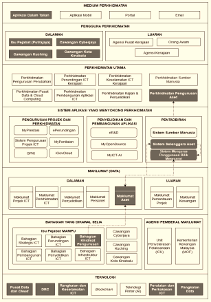
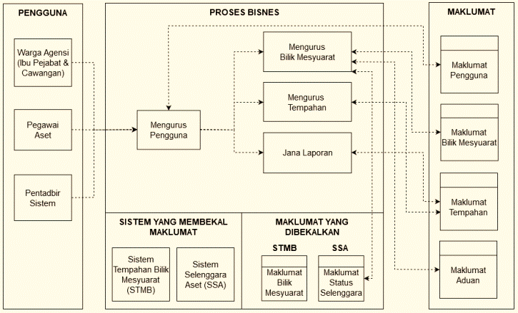
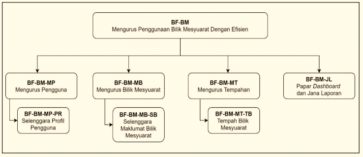
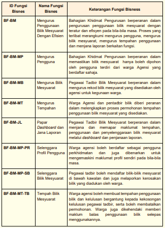
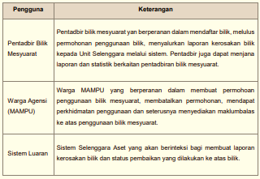
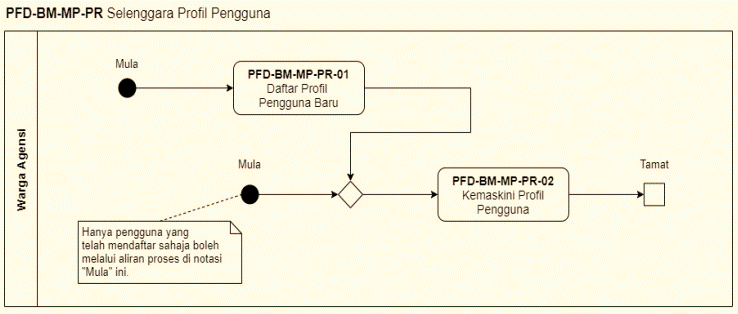
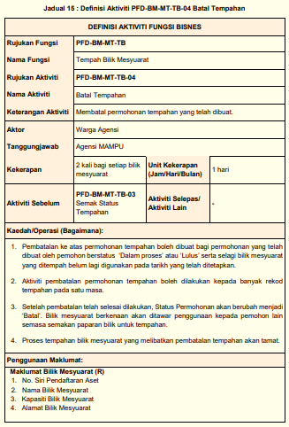
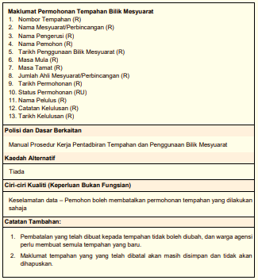

# Introduction
 ||Business Requirements Specification|Software Requirements Specification|Software Design Specification|
 || Refer as **BRS**|Refer as **SRS**|Refer as **SDS**|
|-|---|---|----|
|Definition| A formal document that describes the various requirements provided by the business & describes the various requirements provided by the client.|	It specifies the functional and non-functional requirements present in the software. | Describe the actual software, most from a technical perpective.|
|Creation| derived from the client’s requirements and the client’s interaction | derived from the BRS.| exist when a system is developed. Fine difference, to SRS[^1] | 
|Created by|	 a business analyst.| a system analyst or a system architect. [^2]|Development team.|
|Decribes|	the functional specifications of the software at a very high level.| the technical and functional specification of the software also at a high level.|
|Key terms| Business Function, Business Process & Activity| Module, Sub Module, ERD|

[^1] : SDS may contain limitation that is unable to cater to the SRS and/or has features additional that SRS did not have a need.
[^2] : Although, in some companies, the business analyst can also create an SRS. Some companies do not even have an SRS, instead, they make their BRS detailed enough so that it can be used as SRS.

# Business Requirement Specification
## Business Case

> What is the reason for this need, the need to have this service/system?

## Scope

> What is expected to be covered? Also specify what is out of scope to allow better clarity.

## Stakeholder

> Who are the persons/groups of people affected by this?

| Stakeholder | Description |
| -------- | ------- |
| Employees  | All persons employee by this company. |
| HR Personnel | Person assigned to manage this system. |
| Operation Managers    | Group of persons, who perform approval functions.|  |

## Business Architecture

> In general the organization's setup. What are the mediums use for the service? The users of the service? The main service offering? The existing application systems? The information clusters? Information Providers/Management? The technology and infrastructure?

## Information Architecture

> Specific to the service of the biz case, what information, information provider, business process, users.

## Business Functions

### Hierarchy of business functions

### Business Functions Description

### User List

## Business Process Needs

### Models and definitions

#### Process Flow

#### Activity Definition

# System Requirement Specification
